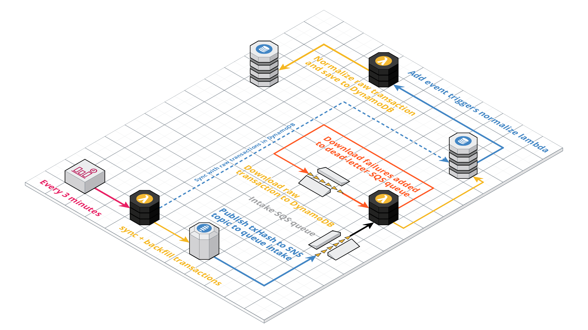

# vault-transaction-indexer

Transacting indexing and processing pipeline for [Castle Labs](https://castle.finance) vaults. Built with AWS CDK + TypeScript.

<!-- **Architecture diagram** -->
<!-- Edit here: -->
<!-- https://app.cloudcraft.co/blueprint/a4a13283-2596-4c25-bff4-0f8b57371760 -->



**Pre-requisites**

-   [Install AWS CLI](https://docs.aws.amazon.com/cli/latest/userguide/getting-started-install.html)

-   [Install CDK CLI](https://docs.aws.amazon.com/cdk/v2/guide/getting_started.html#getting_started_install)

**Getting Started**

Run the following commands to install dependencies, build the CDK stack, and deploy the CDK Stack to AWS.

```
yarn install
yarn --cwd ./src/heartbeat install
yarn build
cdk bootstrap --profile=castle // or whatever AWS profile you're using
cdk deploy --profile=castle // or whatever AWS profile you're using
```

<!-- ### Notes

**Adding a transaction hash to the incoming TX queue:**

In your terminal:

```
aws sns publish
    \ --profile=castle
    \ --subject "incoming-transaction"
    \ --message "4hrtCR3uZJKvbF4oJ52A1irRtkSvuCvcRohiogZ9ScHtzzef583o9h1oyPQSv4GdwppdW9oxdC2cAwLfY6akeqsW"
    \ --topic-arn "arn:aws:sns:us-east-1:410462221023:VaultTransactionIndexerStack-STAGING-vaulttxincomingtopicsolmaxyieldproofcheckeralloccap60devnetstagingv20D51D603-HJJHSCDVEP2Q"
```

and inspect incoming message in the SQS dashboard in AWS. -->

### Environment Variables

We need to define a few environment variables for the `cdk-deploy` GitHub Action to work:

-   `AWS_ACCESS_KEY_ID` - The access key ID for the `heartbeat-deploy` IAM user
-   `AWS_SECRET_ACCESS_KEY` - The secret access key for the `heartbeat-deploy` IAM user
-   `AWS_REGION` - The AWS region to which the resulting Cloudformation stack is deployed. We currently only deploy to `us-east-1`
-   `DATADOG_API_KEY` - Datadog API key for Lambda logging + monitoring

### Scripts

-   `yarn install` - installs dependencies
-   `yarn build` - builds the production-ready CDK Stack
-   `yarn test` - runs Jest
-   `cdk bootstrap` - bootstraps AWS Cloudformation for your CDK deploy
-   `cdk deploy` - deploys the CDK stack to AWS

**Built with**

-   [TypeScript](https://www.typescriptlang.org/)
-   [Jest](https://jestjs.io)
-   [AWS CDK](https://aws.amazon.com/cdk/)
-   [AWS Lambda](https://aws.amazon.com/lambda/)

**Additional Resources**

-   [CDK API Reference](https://docs.aws.amazon.com/cdk/api/latest/docs/aws-construct-library.html)
-   [CDK TypeScript Reference](https://docs.aws.amazon.com/cdk/api/latest/typescript/api/index.html)
-   [CDK Assertion Package](https://github.com/aws/aws-cdk/tree/master/packages/%40aws-cdk/assert)
-   [CDK Datadog Constructs](https://github.com/DataDog/datadog-cdk-constructs)
-   [awesome-cdk repo](https://github.com/eladb/awesome-cdk)

**License**

Closed source.

Built with :heart: by [Castle Labs](https://castle.finance)
